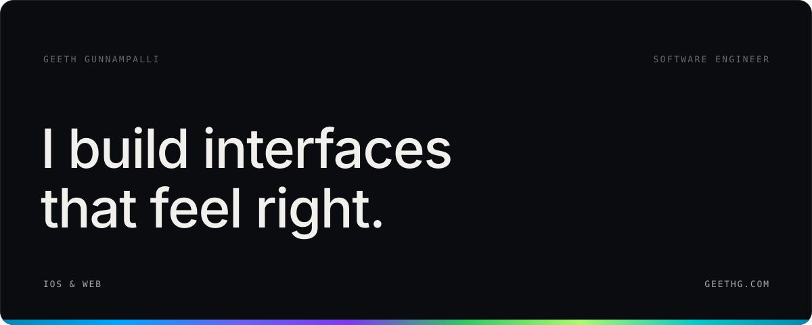

<picture>
  <source media="(prefers-color-scheme: dark)" srcset="assets/hero-dark.svg">
  <source media="(prefers-color-scheme: light)" srcset="assets/hero-light.svg">
  
</picture>

  
    <a href="https://geeth.com"><b>geeth.com</b></a>&nbsp;&nbsp;
    <a href="https://x.com/geethgunna">x</a>&nbsp;&nbsp;
    <a href="https://linkedin.com/in/geethg">linkedin</a>&nbsp;&nbsp;
    <a href="mailto:geeth@radsoftinc.com">email</a>
  

 

Software engineer working across iOS and the web. I care about smooth animation, clean architecture, and the details most people never notice. Currently building Chase Mobile at JPMorganChase and products at [Rad Soft](https://radsoftinc.com).

 

### selected work

<table>
  <tr>
    <td width="50%" valign="top">
      
       <b>MyPanchang</b>&nbsp;&nbsp;iOS & FULLSTACK
       A location-aware Hindu calendar for iPhone: daily Panchang, festivals, and calendar tools.
    </td>
    <td width="50%" valign="top">
      
       <b>Astra Arena</b>&nbsp;&nbsp;FULLSTACK
       Compare AI coding models through real software challenges and weekly tournaments.
    </td>
  </tr>
  <tr>
    <td width="50%" valign="top">
      
       <b>PhotoAura</b>&nbsp;&nbsp;WEB + iOS
       Studio-grade photo delivery for working photographers: albums, client galleries, magic links.
    </td>
    <td width="50%" valign="top">
      
       <b>Markbase</b>&nbsp;&nbsp;DATA PLATFORM
       USPTO trademark search built to make 10M+ public records actually usable.
    </td>
  </tr>
  <tr>
    <td width="50%" valign="top">
      
       <b>ShaderUI</b>&nbsp;&nbsp;DEVELOPER TOOL
       A visual shader and mesh-gradient studio for production-ready WebGL backgrounds.
    </td>
    <td width="50%" valign="top">
      
       <b>TaxNest</b>&nbsp;&nbsp;SAAS
       AI-assisted document collection for CPAs and tax teams, with secure client portals.
    </td>
  </tr>
</table>

### everything else

[Rad Soft](https://radsoftinc.com) · [Reactive Shots](https://reactiveshots.com) · [Syntora](https://syntora.app) · [Cramr](https://cramr.geeth.app) · [SwiftDNS](https://swiftdns.geeth.app) · [HyperGo](https://hypergo.geeth.app) · [ClearKit](https://clearkit.rsft.co) · [Adhaco Construction](https://adhacoinc.com) · [Montvel Media](https://montvel-media.com) · [Decorate Ur Party](https://decorateurparty.com) · [Plaza Park Salon Suites](https://plazaparksalonsuites.com) · [Pista House Irving](https://pistahouseirving.com) · [Pista Express](https://pistaexpress.com) · [Geeth](https://geeth.co)

### now

- Software Engineer I, iOS at **JPMorganChase**, working on Chase Mobile
- Building products at **Rad Soft**
- M.S. Computer Science, AI at **Georgia Tech**, expected 2028

Previously: USAA, HackerRank, UT Dallas OIT, Larsen & Toubro. B.S. Computer Science, UT Dallas.

### stack

  <picture><source media="(prefers-color-scheme: dark)" srcset="https://cdn.simpleicons.org/swift/A5A6AA"></picture>&nbsp;&nbsp;&nbsp;
  <picture><source media="(prefers-color-scheme: dark)" srcset="https://cdn.simpleicons.org/typescript/A5A6AA"></picture>&nbsp;&nbsp;&nbsp;
  <picture><source media="(prefers-color-scheme: dark)" srcset="https://cdn.simpleicons.org/react/A5A6AA"></picture>&nbsp;&nbsp;&nbsp;
  <picture><source media="(prefers-color-scheme: dark)" srcset="https://cdn.simpleicons.org/nextdotjs/A5A6AA"></picture>&nbsp;&nbsp;&nbsp;
  <picture><source media="(prefers-color-scheme: dark)" srcset="https://cdn.simpleicons.org/fastapi/A5A6AA"></picture>&nbsp;&nbsp;&nbsp;
  <picture><source media="(prefers-color-scheme: dark)" srcset="https://cdn.simpleicons.org/postgresql/A5A6AA"></picture>&nbsp;&nbsp;&nbsp;
  <picture><source media="(prefers-color-scheme: dark)" srcset="https://cdn.simpleicons.org/prisma/A5A6AA"></picture>&nbsp;&nbsp;&nbsp;
  <picture><source media="(prefers-color-scheme: dark)" srcset="https://cdn.simpleicons.org/docker/A5A6AA"></picture>&nbsp;&nbsp;&nbsp;
  <picture><source media="(prefers-color-scheme: dark)" srcset="https://cdn.simpleicons.org/cloudflare/A5A6AA"></picture>

plus SwiftUI, UIKit, and whatever the project needs

 

the full index lives at <a href="https://geeth.com">geeth.com</a>

